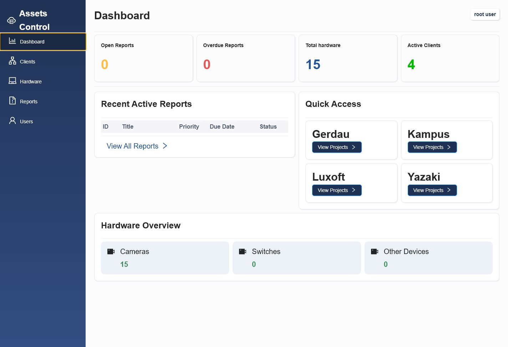
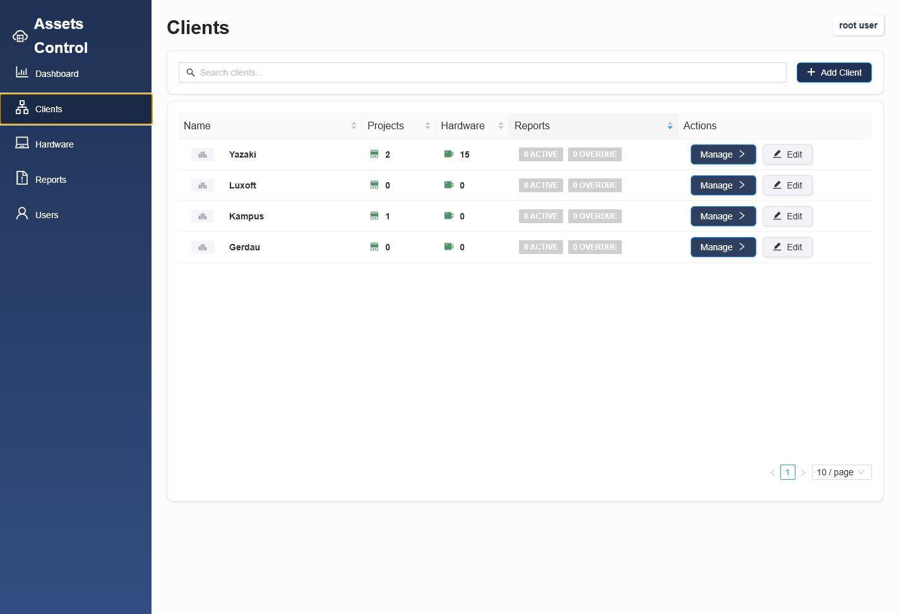
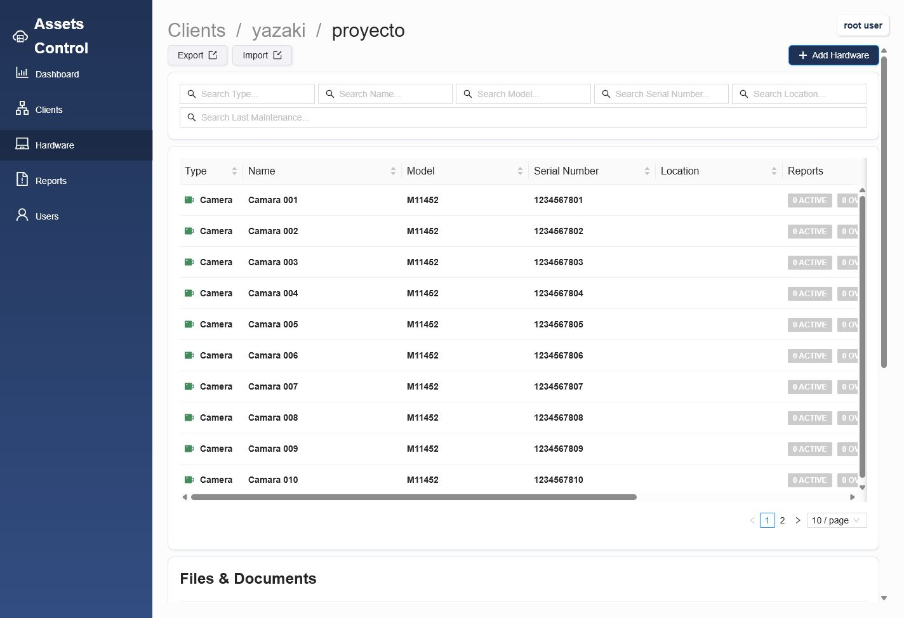
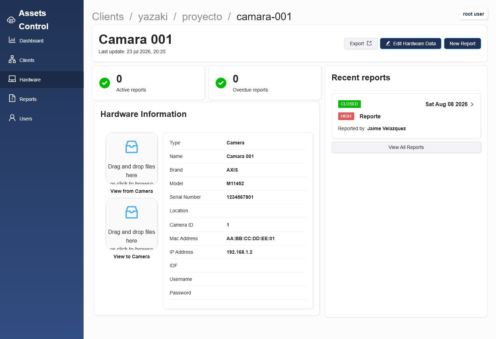
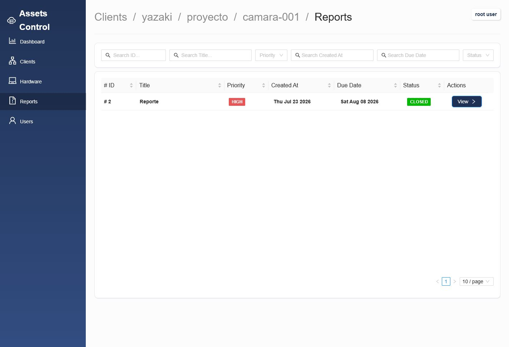

# Assets Control — Frontend

Aplicación web para administrar inventario tecnológico distribuido por clientes y proyectos. Centraliza la consulta de hardware, seguimiento de reportes, documentos técnicos y administración de usuarios en una interfaz única.

> Proyecto de portafolio desarrollado con Angular. Consume la API REST de **Control de Activos** y presenta información operativa mediante una experiencia protegida por autenticación JWT.

## Vista previa

| Dashboard | Clientes |
| --- | --- |
|  |  |



| Detalle del hardware | Reportes del hardware |
| --- | --- |
|  |  |

Las capturas emplean datos de demostración. El inventario mostrado pertenece al cliente **Yazaki**, que contiene hardware de prueba.

## Funcionalidades

- Inicio de sesión con token JWT y rutas protegidas.
- Dashboard con indicadores de reportes, hardware, clientes y accesos rápidos a proyectos.
- Gestión de clientes y sus proyectos/sucursales.
- Inventario de equipos con búsqueda, ordenamiento, paginación y detalle de cámaras.
- Importación y exportación de inventario en XLSX.
- Carga, categorización y descarga de archivos asociados a proyectos.
- Consulta, creación, actualización y seguimiento de reportes con comentarios y evidencia fotográfica.
- Administración de usuarios, roles y contraseñas; la sección está restringida al rol administrador.
- Lector de códigos QR para localizar equipos.

## Tecnologías

| Área | Tecnologías |
| --- | --- |
| Framework | Angular 21, TypeScript |
| Interfaz | ng-zorro-antd, CSS |
| Estado y asincronía | RxJS, servicios Angular |
| Seguridad | Interceptor HTTP, guards de autenticación y roles, JWT |
| Utilidades | ZXing para lectura de QR |
| Herramientas | Angular CLI, npm, Vitest |

## Arquitectura de la aplicación

```text
Pages / Components
        │
        ├── Services y stores → consumo de API y estado de interfaz
        ├── HTTP interceptor  → agrega el JWT a solicitudes autenticadas
        ├── Route guards      → control de sesión y roles
        └── API REST          → backend de Control de Activos
```

Las vistas se organizan por dominio (`dashboard`, `clients`, `hardware`, `reports` y `users`), mientras que los componentes reutilizables cubren tablas, formularios, tarjetas, etiquetas de estado, carga de archivos y navegación.

## Requisitos

- Node.js compatible con Angular 21.
- npm 11 o compatible.
- API de Control de Activos en ejecución. La configuración actual apunta a `http://localhost:3000/api/v1`.

## Instalación y ejecución

```bash
git clone <URL_DEL_REPOSITORIO>
cd asset-tracking-system-frontend
npm install
npm start
```

Después abre `http://localhost:4200`.

Para ejecutar el servidor local con HTTPS usando los certificados incluidos en `certs/`:

```bash
npx ng serve --ssl --ssl-cert certs/localhost+3.pem --ssl-key certs/localhost+3-key.pem
```

La aplicación estará disponible en `https://localhost:4200`.

## Configuración del backend

La URL base de la API y de los archivos está centralizada en [api-url-base.service.ts](src/app/services/api-url-base.service.ts):

```ts
baseUrl = 'http://localhost:3000/api/v1';
imageBaseUrl = 'http://localhost:3000/';
```

Actualiza esos valores para conectarte a otro entorno. El interceptor adjunta automáticamente el JWT almacenado después del inicio de sesión, y los guards impiden acceder a las rutas protegidas sin una sesión válida.

## Rutas principales

| Ruta | Descripción |
| --- | --- |
| `/login` | Autenticación de usuarios. |
| `/dashboard` | Indicadores y accesos rápidos. |
| `/clients` | Directorio de clientes. |
| `/clients/:clientId/:clientSlug` | Proyectos o sucursales de un cliente. |
| `/clients/.../hardware` | Inventario y documentos de un proyecto. |
| `/hardware` | Catálogo global de hardware. |
| `/reports` | Gestión de reportes. |
| `/users` | Administración de usuarios; requiere rol `ADMIN`. |
| `/qr` | Escáner QR. |

## Comandos útiles

```bash
# Ejecutar pruebas unitarias
npm test

# Generar build de producción
npm run build

# Ejecutar compilación en modo observación
npm run watch
```

## Estructura del proyecto

```text
src/app/
├── pages/        # Vistas por dominio
├── components/   # Componentes, formularios y tablas reutilizables
├── services/     # API, autenticación, guards e interceptor
├── store/        # Estado de interfaz y recursos
├── interfaces/   # Contratos TypeScript con el backend
└── app.routes.ts # Rutas y protección de navegación

public/           # Imágenes e iconos estáticos
docs/images/      # Capturas del README
```

## Próximas mejoras

- Mover la configuración de la API a archivos `environment` por entorno.
- Añadir pruebas de componentes y flujos críticos de interfaz.
- Incorporar una demo desplegada y datos de ejemplo reproducibles.
- Mejorar la adaptación a dispositivos móviles.

## Autor

**Jaime Vargas** — Proyecto incluido en mi portafolio profesional.
